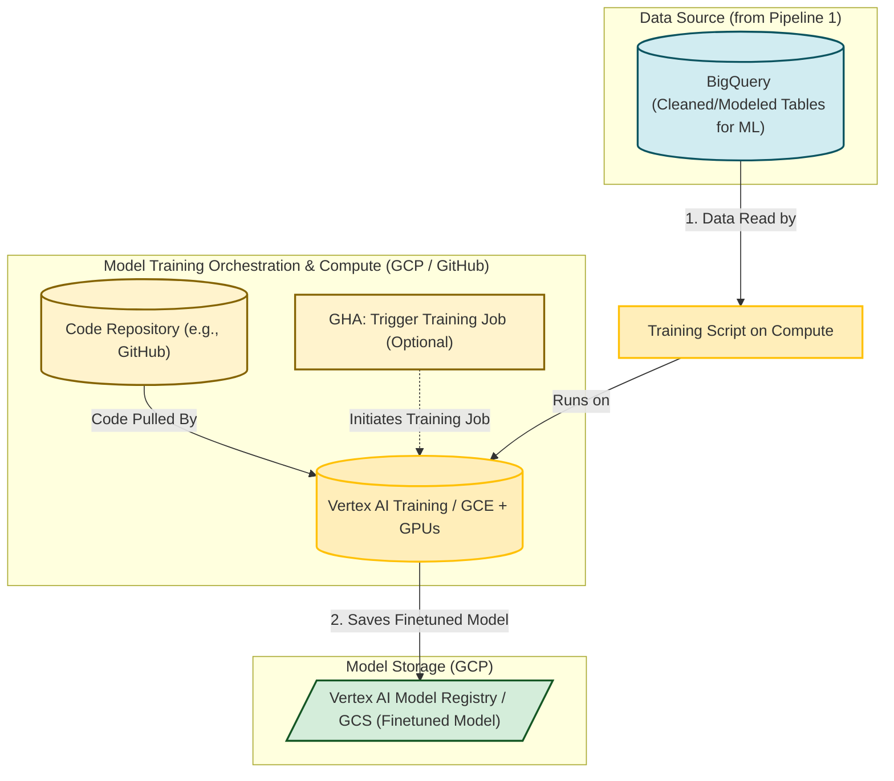

# Meeting the market: using foundational models to extract career guiding insights from Linkedin listing


## III. Fine-Tuning Qwen3.0 1.7B dense: Extracting Structured Insights

With our data pipeline in place, we shift to teaching a powerful Large Language Model (LLM) to extract specific, structured information from job descriptions.



### A. The Goal: From Job Description to Actionable JSON

Our aim is to transform verbose job listings into concise, machine-readable JSON objects. While pre-trained LLMs are broadly capable, **fine-tuning** is essential here. It allows us to adapt the model to the specific nuances of job description language and, crucially, to teach it our precise desired output format (a structured JSON). This yields far greater accuracy and reliability for our specific task than generic prompting.

## System prompt

```plaintext
You are an expert AI assistant tasked with parsing job descriptions and extracting key information into a structured JSON format based on the predefined schema below. Analyze the input job description text carefully, standardize relevant terms (like tool names, locations, role titles), apply controlled vocabularies where specified, and generate the corresponding JSON output. Ensure lists contain standardized values and are empty `[]` if no relevant information is found.
```

## OpenAI json data format

```json
{
  "_comment": "Schema for storing structured job description data.",
  "job_summary": {
    "role_title": {
      "type": ["string", "null"],
      "description": "Standardized primary role title inferred from the description (e.g., 'Data Engineer', 'Data Scientist', 'Cloud Engineer', 'BI Developer'). Use the most specific fitting category."
    },
    "role_objective": {
      "type": ["string", "null"],
      "description": "A concise summary or direct quote of the primary goal or objective of the role as stated in the description."
    },
    "role_seniority": {
      "type": ["string", "null"],
      "description": "Inferred or stated seniority level. Use one of: ['Internship', 'Junior', 'Mid-Level', 'Senior', 'Lead', 'Staff', 'Principal', 'Manager', 'Director', 'Executive', 'Not Specified']."
    },
    "visa_sponsorship": {
        "type": ["boolean", "null"],
        "description": "Set to true if the company explicitly states they Concepts", "NoSQL Concepts", "Other"]
      },
      "data_architecture_concepts": {
          "type": "object",
           "properties": {
                "data_modeling": { "type": ["array", "null"], "items": {"type": "string"}, "description": "Data modeling techniques."},
                "data_storage_paradigms": { "type": ["array", "null"], "items": {"type": "string"}, "description": "Data storage concepts/systems."},
                "etl_elt_pipelines": { "type": ["array", "null"], "items": {"type": "string"}, "description": "Data movement/transformation concepts."},
                "data_governance_quality": { "type": ["array", "null"], "items": {"type": "string"}, "description": "Data governance/quality concepts."},
                "architecture_patterns": { "type": ["array", "null"], "items": {"type": "string"}, "description": "Data architecture patterns."},
                "big_data_concepts": { "type": ["array", "null"], "items": {"type": "string"}, "description": "Big Data specific concepts."},
                "cloud_data_architecture": { "type": ["array", "null"], "items": {"type": "string"}, "description": "Cloud-specific data architecture concepts."},
                "ml_ai_data_concepts": { "type": ["array", "null"], "items": {"type": "string"}, "description": "ML/AI infrastructure/data concepts."},
                "core_principles_optimization": { "type": ["array", "null"], "items": {"type": "string"}, "description": "Core design/optimization principles."}
           },
          "description": "Categorized required knowledge of data architecture concepts."
          // Possible Values within sub-arrays: Standardized concepts like "Dimensional Modeling", "Data Lake Architecture", "ETL Design & Development", "Data Quality Management", "Medallion Architecture", etc.
      },
      "etl_integration_tools": {
          "type": ["array", "null"],
          "items": { "type": "string" },
          "description": "List specific ETL, ELT, or Data Integration tools required."
          // Possible Values: Standardized tool names like "Azure Data Factory", "AWS Glue", "dbt (Data Build Tool)", "Informatica PowerCenter / IDMC", "Talend", "Microsoft SSIS", "Airbyte", "Fivetran", "Matillion", etc.
      },
      "data_visualization_bi_tools": {
          "type": ["array", "null"],
          "items": { "type": "string" },
          "description": "List specific Business Intelligence or Data Visualization tools required."
          // Possible Values: Standardized tool names like "Tableau", "Microsoft Power BI", "Looker / Looker Studio", "QlikView / Qlik Sense", "MicroStrategy", "Apache Superset", "Metabase", "Grafana", "Kibana", "Power Query (Excel/Power BI)", "DAX", "LookML", etc.
      },
      "devops_mlops_ci_cd_tools": {
          "type": ["array", "null"],
          "items": { "type": "string" },
          "description": "List specific DevOps, MLOps, CI/CD, IaC, or Monitoring tools required."
           // Possible Values: Standardized tool names like "Git", "Jenkins", "Terraform", "Kubernetes", "Docker", "Azure DevOps", "GitHub Actions", "MLflow", "Kubeflow", "Datadog", "Prometheus", "Boto3 (AWS SDK for Python)", etc.
      },
      "orchestration_workflow_tools": {
          "type": ["array", "null"],
          "items": { "type": "string" },
          "description": "List specific workflow orchestration tools required."
          // Possible Values: Standardized tool names like "Apache Airflow", "Prefect", "Dagster", "Luigi", "AWS Step Functions", "Azure Logic Apps", etc.
      },
      "other_tools": {
          "type": ["array", "null"],
          "items": { "type": "string" },
          "description": "List other relevant tools not offer visa sponsorship for this role, false if they state they do not. Null if not mentioned."
    }
  },
  "company_information": {
    "company_type": {
      "type": ["string", "null"],
      "description": "Categorize the company based on its primary business model or industry. Use one of: ['Software Product / SaaS', 'E-commerce / Marketplace Platform', 'Fintech', 'Gaming Company / GameTech', 'IT Consulting / System Integration', 'IT Outsourcing / Nearshore / Dev Shop', 'Managed Service Provider (MSP)', 'AI / Data Science Focused', 'Open Source Software Company', 'Low-Code / No-Code Platform', 'Cloud / IT Infrastructure Services', 'Digital Services / Agency', 'Tech Hub / Academy / Recruitment', 'Testing / Inspection / Certification', 'Banking / Financial Institution', 'Healthcare / Pharma / Biotech', 'Automotive / Mobility Provider', 'Manufacturing / Industrial', 'Logistics / Transportation', 'Energy', 'Telecommunications', 'Engineering Services (Non-IT specific)', 'Internal IT / Shared Services', 'Unspecified / Generic Tech', 'Not Specified / Other']."
    },
    "company_values_keywords": {
      "type": ["array", "null"],
      "items": { "type": "string" },
      "description": "List keywords or short phrases representing explicitly stated company values or culture aspects (e.g., 'Inovação', 'Collaboration', 'Transparency', 'Work-life balance')."
    }
  },
  "location_and_work_model": {
    "specification_level": {
        "type": "string",
        "enum": ["Specific Location / Remote Status Identified", "Not Specified"],
        "description": "Indicates if specific location, remote status, or 'Global' was identified."
    },
    "remote_status": {
      "type": ["string", "null"],
      "description": "Identify the primary work model. Use one of: ['Fully Remote', 'Remote (Region Specific)', 'Hybrid', 'Office-based', 'Not Specified']."
    },
    "flexibility": {
      "type": ["array", "null"],
      "items": { "type": "string" },
      "description": "List specific flexibility options mentioned, e.g., ['Flexible Schedule']."
    },
    "locations": {
      "type": ["array", "null"],
      "items": { "type": "string" },
      "description": "List standardized, Title Cased locations (Cities, Countries, Regions, 'Global') mentioned. Sort alphabetically."
    }
  },
  "required_qualifications": {
    "experience_years_min": {
      "type": ["integer", "null"],
      "description": "Minimum years of experience required (e.g., from '1-6 years' extract 1, from '3+ years' extract 3)."
    },
    "experience_years_max": {
      "type": ["integer", "null"],
      "description": "Maximum years of experience specified (e.g., from '1-6 years' extract 6). Null if only minimum or range isn't specified."
    },
    "experience_description": {
      "type": ["string", "null"],
      "description": "The raw text describing the experience requirement (e.g., '1 e 6 anos em projetos de Data', '3+ years of hands-on experience')."
    },
    "education_requirements": {
      "type": ["string", "null"],
      "description": "Required level of education or field of study (e.g., 'BSc Computer Science', 'Licenciatura/ Mestrado nas áreas de Engenharia Informática...')."
    },
    "technical_skills": {
      "programming_languages": {
        "type": "object",
        "properties": {
            "general_purpose": {"type": ["array", "null"], "items": {"type": "string"}, "description": "List standardized general-purpose languages (e.g., Python, Java, Scala, Go, C#, R)."},
            "scripting_frontend": {"type": ["array", "null"], "items": {"type": "string"}, "description": "List standardized scripting or frontend languages/frameworks (e.g., Bash / Shell Scripting, JavaScript, TypeScript, Angular)."},
            "query": {"type": ["array", "null"], "items": {"type": "string"}, "description": "List standardized query languages (e.g., SQL, T-SQL, PL/SQL, Spark SQL, DAX, MDX, Power Query (M))."},
            "data_ml_libs": {"type": ["array", "null"], "items": {"type": "string"}, "description": "List standardized data/ML specific libraries/frameworks (e.g., Pandas, PySpark, Scikit-learn, PyTorch, TensorFlow, R Shiny). Note: Base frameworks like Spark/Flink go here too."},
            "platform_runtime": {"type": ["array", "null"], "items": {"type": "string"}, "description": "List specific platforms/runtimes like '.NET Platform'."},
            "configuration": {"type": ["array", "null"], "items": {"type": "string"}, "description": "List configuration languages like 'YAML'."},
            "other_specialized": {"type": ["array", "null"], "items": {"type": "string"}, "description": "List other specialized languages like ' fitting neatly into the above categories (e.g., IDEs, Data Catalogs, Vector DBs)."
          // Possible Values: Standardized tool names like "Jupyter Notebooks/Lab", "Alation (Data Catalog)", "Dataiku", "VS Code", "Weaviate (Vector DB)", "Pinecone (Vector DB)", "Minio", "ActiveMQ", "RabbitMQ", etc.
      }
    },
    "methodologies_practices": {
      "type": ["array", "null"],
      "items": { "type": "string" },
      "description": "List required development methodologies or practices."
      // Possible Values: ["Agile Principles", "Scrum", "Kanban", "Extreme Programming (XP)", "Lean Principles", "SAFe", "LeSS", "Waterfall", "DevOps Culture/Practices", "Test-Driven Development (TDD)", "Behavior-Driven Development (BDD)", "CI/CD Practices", "A/B Testing"]
    },
    "soft_skills_keywords": {
      "type": ["array", "null"],
      "items": { "type": "string" },
      "description": "List required soft skills or general keywords."
    }
  },

  "preferred_qualifications": {
    "_comment": "Nice-to-have skills and qualifications.",
    "skills_keywords": {
        "type": ["array", "null"],
        "items": { "type": "string" },
        "description": "List of preferred skills, tools, languages, or concepts."
    },
    "other_notes": {
        "type": ["string", "null"],
        "description": "Any other text describing preferred qualifications."
    }
  },

  "role_context": {
     "_comment": "Information about the role's interactions and scope.",
     "collaboration_with": {
        "type": ["array", "null"],
        "items": { "type": "string" },
        "description": "List of teams or roles this position collaborates with."
     },
     "team_structure": {
        "type": ["string", "null"],
        "description": "Description of the team structure or context."
     },
     "project_scope": {
        "type": ["string", "null"],
        "description": "Description of the type or scope of projects involved."
     },
     "key_responsibilities": {
        "type": ["array", "null"],
        "items": { "type": "string" },
        "description": "List of key tasks and responsibilities mentioned."
     }
  },

  "benefits": {
    "_comment": "Perks and benefits offered.",
    "training_development": {
        "type": ["string", "null"],
        "description": "Description of training and development opportunities."
    },
    "learning_platforms": {
        "type": ["array", "null"],
        "items": { "type": "string" },
        "description": "List specific learning platforms mentioned by name (e.g., 'Udemy', 'LinkedIn Learning')."
    },
    "paid_time_off_days": {
        "type": ["integer", "null"],
        "description": "Specific number of paid time off days mentioned."
    },
    "other_benefits_keywords": {
        "type": ["array", "null"],
        "items": { "type": "string" },
        "description": "List keywords for other benefits (e.g., 'Health Insurance', 'Meal Allowance', 'Well-being Program')."
    }
  }
}
```

## Example output

```json
{
    "job_summary": {
        "role_title": "DevOps Engineer",
        "role_objective": "help scale, automate, and optimize our cloud infrastructure",
        "role_seniority": "Mid-Level",
        "visa_sponsorship": false
    },
    "company_information": {
        "company_type": "Software Product / SaaS",
        "company_values_keywords": [
            "Collaboration"
        ]
    },
    "location_and_work_model": {
        "specification_level": "Not Specified",
        "remote_status": "Remote (Region Specific)",
        "flexibility": [
            "Flexible Schedule"
        ],
        "locations": []
    },
    "required_qualifications": {
        "experience_years_min": 0,
        "experience_years_max": 0,
        "experience_description": "Experience writing and managing infrastructure as code (IaC).",
        "education_requirements": "Not Specified",
        "technical_skills": {
            "programming_languages": {
                "general_purpose": [
                    "Python"
                ],
                "scripting_frontend": [
                    "Bash / Shell Scripting",
                    "PowerShell"
                ],
                "query": [],
                "data_ml_libs": [],
                "platform_runtime": [],
                "configuration": [],
                "other_specialized": []
            },
            "cloud_services_tools": [
                "AKS",
                "Azure DevOps",
                "App Services",
                "Azure Monitor"
            ],
            "cloud_platforms": [
                "Azure"
            ],
            "database_technologies": [],
            "data_architecture_concepts": {
                "data_modeling": [],
                "data_storage_paradigms": [],
                "etl_elt_pipelines": [],
                "data_governance_quality": [],
                "architecture_patterns": [],
                "big_data_concepts": [],
                "cloud_data_architecture": [],
                "ml_ai_data_concepts": [],
                "core_principles_optimization": []
            },
            "etl_integration_tools": [],
            "data_visualization_bi_tools": [
                "Grafana"
            ],
            "devops_mlops_ci_cd_tools": [
                "Git",
                "GitHub Actions",
                "Kubernetes",
                "Docker"
            ],
            "orchestration_workflow_tools": [],
            "other_tools": [
                "Prometheus"
            ]
        },
        "methodologies_practices": [
            "DevOps Culture/Practices"
        ],
        "soft_skills_keywords": []
    },
    "preferred_qualifications": {
        "skills_keywords": [
            "SOC 2",
            "Security"
        ],
        "other_notes": "Experience with SOC 2 compliance and security best practices"
    },
    "role_context": {
        "collaboration_with": [
            "Software Engineers"
        ],
        "team_structure": "Not Specified",
        "project_scope": "Not Specified",
        "key_responsibilities": [
            "Design, implement, and maintain Azure infrastructure using Terraform.",
            "Build and manage GitHub Actions workflows to streamline deployments and testing.",
            "Ensure high availability, security, and performance of our Azure-based environments.",
            "Set up logging, monitoring, and alerting solutions to proactively identify issues.",
            "Implement best practices for identity management, role-based access control (RBAC), and security policies in Azure.",
            "Work closely with software engineers to improve deployment strategies and DevOps best practices.",
            "Identify performance bottlenecks and optimize cloud resources."
        ]
    },
    "benefits": {
        "training_development": "Professional development opportunities for training to advance your career.",
        "learning_platforms": [],
        "paid_time_off_days": 0,
        "other_benefits_keywords": [
            "Health Insurance",
            "Dental Insurance",
            "Performance-based Bonus",
            "Well-being Program"
        ]
    }
}
```

## Example full context (ChatML format)

Tokenized length: 4358

```plaintext
Example formatted entry (first one from mapped dataset):
  Text (first 300 chars): <|im_start|>system
You are an expert AI assistant tasked with parsing job descriptions and extracting key information into a structured JSON format based on the predefined schema below. Analyze the input job description text carefully, standardize relevant terms (like tool names, locations, role titles), apply controlled vocabularies where specified, and generate the corresponding JSON output. Ensure lists contain standardized values and are empty `[]` if no relevant information is found.

**JSON Schema Definition:**

```json
{
  "_comment": "Schema for storing structured job description data.",
  "job_summary": {
    "role_title": {
      "type": ["string", "null"],
      "description": "Standardized primary role title inferred from the description (e.g., 'Data Engineer', 'Data Scientist', 'Cloud Engineer', 'BI Developer'). Use the most specific fitting category."
    },
    "role_objective": {
      "type": ["string", "null"],
      "description": "A concise summary or direct quote of the primary goal or objective of the role as stated in the description."
    },
    "role_seniority": {
      "type": ["string", "null"],
      "description": "Inferred or stated seniority level. Use one of: ['Internship', 'Junior', 'Mid-Level', 'Senior', 'Lead', 'Staff', 'Principal', 'Manager', 'Director', 'Executive', 'Not Specified']."
    },
    "visa_sponsorship": {
        "type": ["boolean", "null"],
        "description": "Set to true if the company explicitly states they Concepts", "NoSQL Concepts", "Other"]
      },
      "data_architecture_concepts": {
          "type": "object",
           "properties": {
                "data_modeling": { "type": ["array", "null"], "items": {"type": "string"}, "description": "Data modeling techniques."},
                "data_storage_paradigms": { "type": ["array", "null"], "items": {"type": "string"}, "description": "Data storage concepts/systems."},
                "etl_elt_pipelines": { "type": ["array", "null"], "items": {"type": "string"}, "description": "Data movement/transformation concepts."},
                "data_governance_quality": { "type": ["array", "null"], "items": {"type": "string"}, "description": "Data governance/quality concepts."},
                "architecture_patterns": { "type": ["array", "null"], "items": {"type": "string"}, "description": "Data architecture patterns."},
                "big_data_concepts": { "type": ["array", "null"], "items": {"type": "string"}, "description": "Big Data specific concepts."},
                "cloud_data_architecture": { "type": ["array", "null"], "items": {"type": "string"}, "description": "Cloud-specific data architecture concepts."},
                "ml_ai_data_concepts": { "type": ["array", "null"], "items": {"type": "string"}, "description": "ML/AI infrastructure/data concepts."},
                "core_principles_optimization": { "type": ["array", "null"], "items": {"type": "string"}, "description": "Core design/optimization principles."}
           },
          "description": "Categorized required knowledge of data architecture concepts."
          // Possible Values within sub-arrays: Standardized concepts like "Dimensional Modeling", "Data Lake Architecture", "ETL Design & Development", "Data Quality Management", "Medallion Architecture", etc.
      },
      "etl_integration_tools": {
          "type": ["array", "null"],
          "items": { "type": "string" },
          "description": "List specific ETL, ELT, or Data Integration tools required."
          // Possible Values: Standardized tool names like "Azure Data Factory", "AWS Glue", "dbt (Data Build Tool)", "Informatica PowerCenter / IDMC", "Talend", "Microsoft SSIS", "Airbyte", "Fivetran", "Matillion", etc.
      },
      "data_visualization_bi_tools": {
          "type": ["array", "null"],
          "items": { "type": "string" },
          "description": "List specific Business Intelligence or Data Visualization tools required."
          // Possible Values: Standardized tool names like "Tableau", "Microsoft Power BI", "Looker / Looker Studio", "QlikView / Qlik Sense", "MicroStrategy", "Apache Superset", "Metabase", "Grafana", "Kibana", "Power Query (Excel/Power BI)", "DAX", "LookML", etc.
      },
      "devops_mlops_ci_cd_tools": {
          "type": ["array", "null"],
          "items": { "type": "string" },
          "description": "List specific DevOps, MLOps, CI/CD, IaC, or Monitoring tools required."
           // Possible Values: Standardized tool names like "Git", "Jenkins", "Terraform", "Kubernetes", "Docker", "Azure DevOps", "GitHub Actions", "MLflow", "Kubeflow", "Datadog", "Prometheus", "Boto3 (AWS SDK for Python)", etc.
      },
      "orchestration_workflow_tools": {
          "type": ["array", "null"],
          "items": { "type": "string" },
          "description": "List specific workflow orchestration tools required."
          // Possible Values: Standardized tool names like "Apache Airflow", "Prefect", "Dagster", "Luigi", "AWS Step Functions", "Azure Logic Apps", etc.
      },
      "other_tools": {
          "type": ["array", "null"],
          "items": { "type": "string" },
          "description": "List other relevant tools not offer visa sponsorship for this role, false if they state they do not. Null if not mentioned."
    }
  },
  "company_information": {
    "company_type": {
      "type": ["string", "null"],
      "description": "Categorize the company based on its primary business model or industry. Use one of: ['Software Product / SaaS', 'E-commerce / Marketplace Platform', 'Fintech', 'Gaming Company / GameTech', 'IT Consulting / System Integration', 'IT Outsourcing / Nearshore / Dev Shop', 'Managed Service Provider (MSP)', 'AI / Data Science Focused', 'Open Source Software Company', 'Low-Code / No-Code Platform', 'Cloud / IT Infrastructure Services', 'Digital Services / Agency', 'Tech Hub / Academy / Recruitment', 'Testing / Inspection / Certification', 'Banking / Financial Institution', 'Healthcare / Pharma / Biotech', 'Automotive / Mobility Provider', 'Manufacturing / Industrial', 'Logistics / Transportation', 'Energy', 'Telecommunications', 'Engineering Services (Non-IT specific)', 'Internal IT / Shared Services', 'Unspecified / Generic Tech', 'Not Specified / Other']."
    },
    "company_values_keywords": {
      "type": ["array", "null"],
      "items": { "type": "string" },
      "description": "List keywords or short phrases representing explicitly stated company values or culture aspects (e.g., 'Inovação', 'Collaboration', 'Transparency', 'Work-life balance')."
    }
  },
  "location_and_work_model": {
    "specification_level": {
        "type": "string",
        "enum": ["Specific Location / Remote Status Identified", "Not Specified"],
        "description": "Indicates if specific location, remote status, or 'Global' was identified."
    },
    "remote_status": {
      "type": ["string", "null"],
      "description": "Identify the primary work model. Use one of: ['Fully Remote', 'Remote (Region Specific)', 'Hybrid', 'Office-based', 'Not Specified']."
    },
    "flexibility": {
      "type": ["array", "null"],
      "items": { "type": "string" },
      "description": "List specific flexibility options mentioned, e.g., ['Flexible Schedule']."
    },
    "locations": {
      "type": ["array", "null"],
      "items": { "type": "string" },
      "description": "List standardized, Title Cased locations (Cities, Countries, Regions, 'Global') mentioned. Sort alphabetically."
    }
  },
  "required_qualifications": {
    "experience_years_min": {
      "type": ["integer", "null"],
      "description": "Minimum years of experience required (e.g., from '1-6 years' extract 1, from '3+ years' extract 3)."
    },
    "experience_years_max": {
      "type": ["integer", "null"],
      "description": "Maximum years of experience specified (e.g., from '1-6 years' extract 6). Null if only minimum or range isn't specified."
    },
    "experience_description": {
      "type": ["string", "null"],
      "description": "The raw text describing the experience requirement (e.g., '1 e 6 anos em projetos de Data', '3+ years of hands-on experience')."
    },
    "education_requirements": {
      "type": ["string", "null"],
      "description": "Required level of education or field of study (e.g., 'BSc Computer Science', 'Licenciatura/ Mestrado nas áreas de Engenharia Informática...')."
    },
    "technical_skills": {
      "programming_languages": {
        "type": "object",
        "properties": {
            "general_purpose": {"type": ["array", "null"], "items": {"type": "string"}, "description": "List standardized general-purpose languages (e.g., Python, Java, Scala, Go, C#, R)."},
            "scripting_frontend": {"type": ["array", "null"], "items": {"type": "string"}, "description": "List standardized scripting or frontend languages/frameworks (e.g., Bash / Shell Scripting, JavaScript, TypeScript, Angular)."},
            "query": {"type": ["array", "null"], "items": {"type": "string"}, "description": "List standardized query languages (e.g., SQL, T-SQL, PL/SQL, Spark SQL, DAX, MDX, Power Query (M))."},
            "data_ml_libs": {"type": ["array", "null"], "items": {"type": "string"}, "description": "List standardized data/ML specific libraries/frameworks (e.g., Pandas, PySpark, Scikit-learn, PyTorch, TensorFlow, R Shiny). Note: Base frameworks like Spark/Flink go here too."},
            "platform_runtime": {"type": ["array", "null"], "items": {"type": "string"}, "description": "List specific platforms/runtimes like '.NET Platform'."},
            "configuration": {"type": ["array", "null"], "items": {"type": "string"}, "description": "List configuration languages like 'YAML'."},
            "other_specialized": {"type": ["array", "null"], "items": {"type": "string"}, "description": "List other specialized languages like ' fitting neatly into the above categories (e.g., IDEs, Data Catalogs, Vector DBs)."
          // Possible Values: Standardized tool names like "Jupyter Notebooks/Lab", "Alation (Data Catalog)", "Dataiku", "VS Code", "Weaviate (Vector DB)", "Pinecone (Vector DB)", "Minio", "ActiveMQ", "RabbitMQ", etc.
      }
    },
    "methodologies_practices": {
      "type": ["array", "null"],
      "items": { "type": "string" },
      "description": "List required development methodologies or practices."
      // Possible Values: ["Agile Principles", "Scrum", "Kanban", "Extreme Programming (XP)", "Lean Principles", "SAFe", "LeSS", "Waterfall", "DevOps Culture/Practices", "Test-Driven Development (TDD)", "Behavior-Driven Development (BDD)", "CI/CD Practices", "A/B Testing"]
    },
    "soft_skills_keywords": {
      "type": ["array", "null"],
      "items": { "type": "string" },
      "description": "List required soft skills or general keywords."
    }
  },

  "preferred_qualifications": {
    "_comment": "Nice-to-have skills and qualifications.",
    "skills_keywords": {
        "type": ["array", "null"],
        "items": { "type": "string" },
        "description": "List of preferred skills, tools, languages, or concepts."
    },
    "other_notes": {
        "type": ["string", "null"],
        "description": "Any other text describing preferred qualifications."
    }
  },

  "role_context": {
     "_comment": "Information about the role's interactions and scope.",
     "collaboration_with": {
        "type": ["array", "null"],
        "items": { "type": "string" },
        "description": "List of teams or roles this position collaborates with."
     },
     "team_structure": {
        "type": ["string", "null"],
        "description": "Description of the team structure or context."
     },
     "project_scope": {
        "type": ["string", "null"],
        "description": "Description of the type or scope of projects involved."
     },
     "key_responsibilities": {
        "type": ["array", "null"],
        "items": { "type": "string" },
        "description": "List of key tasks and responsibilities mentioned."
     }
  },

  "benefits": {
    "_comment": "Perks and benefits offered.",
    "training_development": {
        "type": ["string", "null"],
        "description": "Description of training and development opportunities."
    },
    "learning_platforms": {
        "type": ["array", "null"],
        "items": { "type": "string" },
        "description": "List specific learning platforms mentioned by name (e.g., 'Udemy', 'LinkedIn Learning')."
    },
    "paid_time_off_days": {
        "type": ["integer", "null"],
        "description": "Specific number of paid time off days mentioned."
    },
    "other_benefits_keywords": {
        "type": ["array", "null"],
        "items": { "type": "string" },
        "description": "List keywords for other benefits (e.g., 'Health Insurance', 'Meal Allowance', 'Well-being Program')."
    }
  }
}
<|im_end|>
<|im_start|>user
Job Description:
About Vaibe
Vaibe is a leading B2B white-label software gamification venture of Körber Digital, envisions a future where every software provider seamlessly integrates gamification software features tailored to their unique needs and brand identity. Through strategic partnerships and collaboration, we empower software providers to unlock new opportunities, increase customer satisfaction, and drive growth. Our agile venturing approach positions us as the trusted partner for software providers seeking differentiation in the market and offering an innovative solution to boost employee engagement and productivity.
About The Role
We are looking for a Mid-Level DevOps Engineer to join our team and help scale, automate, and optimize our cloud infrastructure. You will be responsible for designing, implementing, and maintaining CI/CD pipelines, managing Azure cloud infrastructure, and ensuring smooth deployments using Terraform and GitHub Actions.
Key Responsibilities
Infrastructure as Code (IaC): Design, implement, and maintain Azure infrastructure using Terraform.
CI/CD Automation: Build and manage GitHub Actions workflows to streamline deployments and testing.
Cloud Operations: Ensure high availability, security, and performance of our Azure-based environments.
Monitoring & Observability: Set up logging, monitoring, and alerting solutions to proactively identify issues.
Security & Compliance: Implement best practices for identity management, role-based access control (RBAC), and security policies in Azure.
Collaboration: Work closely with software engineers to improve deployment strategies and DevOps best practices.
Troubleshooting & Optimization: Identify performance bottlenecks and optimize cloud resources.
Must-Have Skills
Terraform – Experience writing and managing infrastructure as code (IaC).
Azure Cloud – Hands-on experience with Azure services like AKS, Azure DevOps, App Services, Networking, and Storage.
GitHub Actions – Experience setting up and optimizing CI/CD pipelines.
Linux & Scripting – Familiarity with shell scripting, PowerShell, or Python for automation.
Monitoring Tools – Experience with Prometheus, Grafana, Azure Monitor, or similar tools.
Networking & Security – Understanding of vNET, VPNs, firewalls, and RBAC policies in Azure.
Experience with Kubernetes (AKS)
Knowledge of Docker and containerization
Nice-to-Have Skills
Experience with SOC 2 compliance and security best practices
Your Benefits
Engage in exciting tasks within a fast-growing, future-oriented industry in a collaborative atmosphere.
Receive a competitive salary along with a performance-based bonus.
Access private health and dental insurance plans.
Enjoy extra days off, flexible working hours, and remote work options.
Professional development opportunities for training to advance your career.
Participate in team-building activities within a fun and collaborative environment.
Benefit from a comprehensive perks package, including partnerships and other caring benefits.

Extract the structured data into the specified JSON format.<|im_end|>
<|im_start|>assistant
{"job_summary": {"role_title": "DevOps Engineer", "role_objective": "help scale, automate, and optimize our cloud infrastructure", "role_seniority": "Mid-Level", "visa_sponsorship": false}, "company_information": {"company_type": "Software Product / SaaS", "company_values_keywords": ["Collaboration"]}, "location_and_work_model": {"specification_level": "Not Specified", "remote_status": "Remote (Region Specific)", "flexibility": ["Flexible Schedule"], "locations": []}, "required_qualifications": {"experience_years_min": 0, "experience_years_max": 0, "experience_description": "Experience writing and managing infrastructure as code (IaC).", "education_requirements": "Not Specified", "technical_skills": {"programming_languages": {"general_purpose": ["Python"], "scripting_frontend": ["Bash / Shell Scripting", "PowerShell"], "query": [], "data_ml_libs": [], "platform_runtime": [], "configuration": [], "other_specialized": []}, "cloud_services_tools": ["AKS", "Azure DevOps", "App Services", "Azure Monitor"], "cloud_platforms": ["Azure"], "database_technologies": [], "data_architecture_concepts": {"data_modeling": [], "data_storage_paradigms": [], "etl_elt_pipelines": [], "data_governance_quality": [], "architecture_patterns": [], "big_data_concepts": [], "cloud_data_architecture": [], "ml_ai_data_concepts": [], "core_principles_optimization": []}, "etl_integration_tools": [], "data_visualization_bi_tools": ["Grafana"], "devops_mlops_ci_cd_tools": ["Git", "GitHub Actions", "Kubernetes", "Docker"], "orchestration_workflow_tools": [], "other_tools": ["Prometheus"]}, "methodologies_practices": ["DevOps Culture/Practices"], "soft_skills_keywords": []}, "preferred_qualifications": {"skills_keywords": ["SOC 2", "Security"], "other_notes": "Experience with SOC 2 compliance and security best practices"}, "role_context": {"collaboration_with": ["Software Engineers"], "team_structure": "Not Specified", "project_scope": "Not Specified", "key_responsibilities": ["Design, implement, and maintain Azure infrastructure using Terraform.", "Build and manage GitHub Actions workflows to streamline deployments and testing.", "Ensure high availability, security, and performance of our Azure-based environments.", "Set up logging, monitoring, and alerting solutions to proactively identify issues.", "Implement best practices for identity management, role-based access control (RBAC), and security policies in Azure.", "Work closely with software engineers to improve deployment strategies and DevOps best practices.", "Identify performance bottlenecks and optimize cloud resources."]}, "benefits": {"training_development": "Professional development opportunities for training to advance your career.", "learning_platforms": [], "paid_time_off_days": 0, "other_benefits_keywords": ["Health Insurance", "Dental Insurance", "Performance-based Bonus", "Well-being Program"]}}<|im_end|>...
```
```

### B. Core Technologies & Rationale

Several key technologies underpin our fine-tuning approach, chosen for efficiency and effectiveness:

*   **Model: Qwen3.0 1.7B (distilled from Gemini-2.0-flash) 1k samples**
    *   **Why:** This model offers a strong balance of capability (1.7 billion parameters) and instruction-following prowess. Being "distilled" suggests it has learned efficiently from a larger model (Gemini-2.0-flash), making it a potent base for our task.

*   **Context Window (`max_seq_length = 5120`)**
    *   **What:** The maximum number of tokens (words/sub-words) the model can process in a single input.
    *   **Why 5120 context size:** Job descriptions can be lengthy. A 5120-token window is chosen to accommodate most listings comprehensively, ensuring the model sees the full context needed for accurate extraction without truncation.

*   **PEFT (Parameter-Efficient Fine-Tuning) with LoRA (Low-Rank Adaptation)**
    *   **What:** PEFT techniques allow fine-tuning a small subset of an LLM's parameters instead of all of them. LoRA is a popular PEFT method that injects small, trainable "adapter" layers into the existing model architecture.
    *   **Why LoRA:**
        *   **Reduced VRAM:** Training only a fraction of parameters drastically lowers GPU memory requirements.
        *   **Faster Training:** Fewer parameters to update means quicker training iterations.
        *   **Smaller Checkpoints:** Only the adapter weights (a few megabytes) need to be saved, not the entire multi-gigabyte base model.
        *   **Avoids Catastrophic Forgetting:** The base model's knowledge is largely preserved.

*   **Quantization (`load_in_4bit = True`)**
    *   **What:** A technique to represent model weights using fewer bits (e.g., 4-bit instead of 16-bit or 32-bit).
    *   **Why:** This significantly reduces the model's memory footprint (both on disk and in VRAM during inference/training), making it feasible to run and fine-tune large models on more accessible hardware. This is often used in conjunction with LoRA (as in QLoRA).

### C. The Fine-Tuning Workflow (Streamlined)

Our process, implemented in a Python notebook, follows these key stages:

1.  **Setup & Model Loading:**
    *   Import necessary libraries, including `unsloth` first for its optimizations.
    *   Load the Qwen3.0 8B model using Unsloth's `FastLanguageModel`, enabling `4-bit quantization` for memory savings.
    *   Apply a `LoraConfig` to the model, specifying which layers to adapt (e.g., `q_proj`, `v_proj`) and LoRA parameters like rank (`r`) and `alpha`.

2.  **Data Preparation for Instruction Following:**
    *   **Fetch Data:** Load the cleaned job listings from BigQuery (output of our Dataform pipeline).
    *   **Craft Instructions:** This is paramount. Each job description is formatted into a specific prompt structure using our `PROMPT_FORMAT_STRING`. This template clearly tells the model its role, the information to extract, the expected JSON output structure, and then provides the job description itself. This turns our task into an instruction-following problem.
        ```python
        # Simplified conceptual structure of the prompt string:
        # SYSTEM_MESSAGE = "You are an expert job description extractor..."
        # INSTRUCTION = "Extract skills, experience, benefits... into this JSON format: { 'skills': [], ...}"
        # JOB_DESCRIPTION_INPUT = "{actual_job_text}"
        # EXPECTED_JSON_OUTPUT_FOR_TRAINING = "{'skills': ['python', 'sql'], ...}"
        # formatted_example = f"{SYSTEM_MESSAGE}\n{INSTRUCTION}\nJob: {JOB_DESCRIPTION_INPUT}\nOutput: {EXPECTED_JSON_OUTPUT_FOR_TRAINING}"
        ```
    *   **Tokenize:** Convert these text-based instruction-response pairs into numerical tokens the model understands using its tokenizer.
    *   Filter out any invalid or empty examples post-tokenization.

3.  **Training:**
    *   Configure `TrainingArguments` specifying batch size, learning rate, number of epochs/steps, and output directories.
    *   Utilize the `SFTTrainer` (Supervised Fine-tuning Trainer) from `trl`, providing it with the model, tokenizer, formatted training dataset, PEFT/LoRA config, and training arguments.
    *   Initiate training (`trainer.train()`). The model learns by trying to predict the `EXPECTED_JSON_OUTPUT_FOR_TRAINING` given the instruction and job description.

4.  **Saving the Model:**
    *   **LoRA Adapters:** Save the trained LoRA adapter weights (`model.save_pretrained("qwen_job_extractor_lora")`). These are small and can be loaded on top of the original base model for inference.
    *   **Merged Model (Optional):** For simpler deployment, the LoRA adapters can be merged with the base model weights and saved as a full model checkpoint (`model.merge_and_unload()` then `save_pretrained`).

This fine-tuning process, leveraging PEFT, quantization, and clear instruction prompting, transforms the general-purpose Qwen3.0 8B into a specialized tool for extracting valuable, structured career insights from LinkedIn listings.

