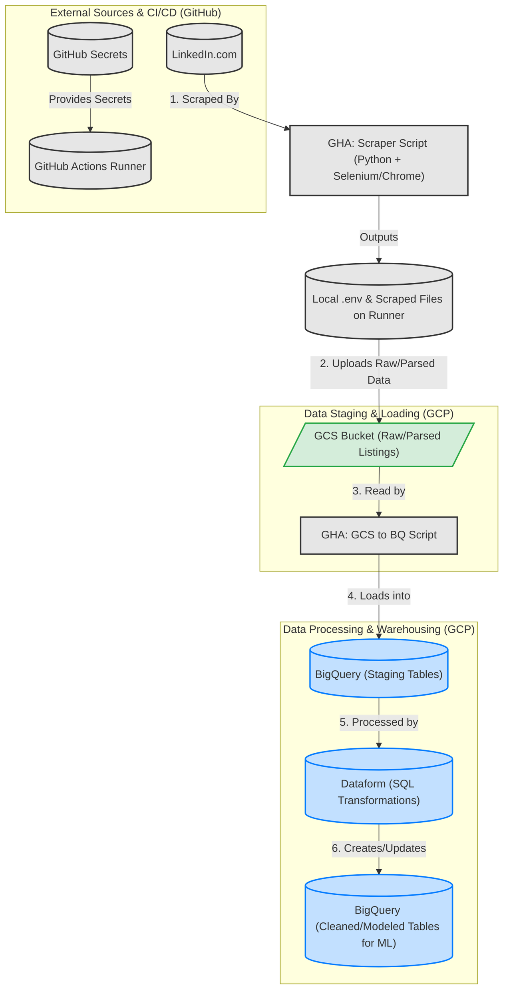
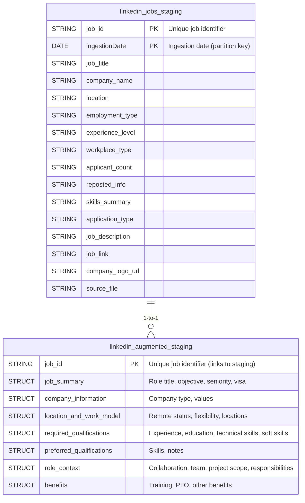

# Meeting the market: using foundational models to extract career guiding insights from Linkedin listing

**I. Introduction: The Quest for Career Clarity -  A data driven approach**
    *   The challenge: Navigating the job market, understanding required skills, and identifying true opportunities.
    *   Our goal: Leverage LLMs to distill actionable career guidance from LinkedIn job listings.
    *   Scalable pipeline with a fine tuned model: A fine-tuned Qwen3.0 1.7B (distilled from Gemini-2.0-flash) for structured information extraction.

The question I had, as a junior dev, is what are the skills the market currently needs and how can I **optimize my specialization path** based on the **assumption that not skills are equally valuable**.


## II. Building the Foundation: The Data Pipeline



Before we can even think about fine-tuning sophisticated language models, we need data – lots of clean, relevant data. This section details our automated pipeline designed to gather, process, and store LinkedIn job listings, transforming them from raw web content into a structured dataset ready for our AI.

### A. Overview: From LinkedIn to Labeled Data

Our primary goal here is to reliably and automatically collect job listings, parse them for key information, and store them in a way that's accessible and efficient for later stages. This involves several key components working in concert:

*   **Goal:** Reliably and automatically gather, process, and store LinkedIn job listings.
*   **Key Components:**
    *   Web Scraping: To extract data from LinkedIn.
    *   Cloud Storage: For staging raw and processed data.
    *   Data Warehousing: For structured storage and analytics.
    *   Workflow Orchestration: To automate the entire process.
*   **Tech Stack Highlights:**
    *   Python: The primary language for scripting our pipeline.
    *   Selenium: For browser automation to navigate and scrape LinkedIn.
    *   GitHub Actions: For CI/CD and scheduling our data collection workflows.
    *   Google Cloud Storage (GCS): Our chosen cloud object storage solution.
    *   Google BigQuery: Our powerful, serverless data warehouse.
    *   Dataform: For transforming and modeling data within BigQuery.

### Architecture 


| Component | Technology | Description |
|-----------|------------|-------------|
| **Runner Environment** | GitHub Cloud | Cloud-based environment for executing pipeline processes |
| **Orchestrator** | GitHub Actions | Scheduling and triggering pipeline executions with CI/CD integration |
| **Pipeline Workflow & Visualization** | Prefect | Workflow definition, monitoring, and observability |
| **Web Scraping** | Python + Selenium | Browser automation to navigate and extract data from LinkedIn |
| **Object Storage** | Google Cloud Storage (GCS) | Staging raw scraped data and intermediate processing outputs |
| **Data Warehousing** | Google BigQuery | Serverless analytics database for structured job data |
| **ELT Processing** | Dataform | SQL-based transformations and data modeling within BigQuery |
| **Training Hardware** | NVIDIA P100 | GPU-accelerated computing for machine learning model training |

### Workflow Orchestration


### B. Phase 1: Scraping and Initial Storage 

The first major step is getting the raw job data from LinkedIn. We use a GitHub Actions workflow, aptly named `"Scrape and Parse to GCS"`, to manage this.


The initial phase focuses on extracting job data from LinkedIn and preparing it for our data warehouse. This is automated via a GitHub Actions workflow.




1.  **Environment & Dependencies:**
    *   The workflow runs on an `ubuntu-latest` GitHub runner with Python `3.10.6`.
    *   **Google Chrome is installed:** Essential for Selenium, our browser automation tool, to interact with LinkedIn's dynamic, JavaScript-rich job pages.
    *   Modular dependencies are managed with separate `requirements.txt` files for the scraper, parser logic, and GCS/BigQuery sink, ensuring clean component separation.

2.  **LinkedIn Scraping & On-the-Fly Parsing (`src/events/linkedin_scraper/main.py`):**
    This script is the workhorse for data acquisition:
    *   **Core Mechanism:** Uses Selenium to control Chrome, performing actions like login (via credentials/cookies), keyword/location-based searches, and navigating through paginated results.
    *   **Extraction & Structuring:** As data is scraped, it's immediately parsed. Raw HTML is processed (e.g., using BeautifulSoup/lxml, as implied by the "parser" dependencies) to extract key fields: Job Title, Company, Location, full Job Description text, Post URL, etc.
    *   **Output to GCS:** The extracted and structured data (ideally as JSONL or Parquet for efficiency) is then directly uploaded to a designated Google Cloud Storage (GCS) bucket. GCS serves as our scalable and cost-effective staging area.

3.  **Loading to Data Warehouse (`src/events/gcs_to_bg_sink/gcs_to_bq.py`):**
    With structured data staged in GCS, the final step of this phase is loading it into our analytical store:
    *   **GCS to BigQuery Transfer:** This script efficiently batch-loads the parsed data from GCS into Google BigQuery.
    *   **BigQuery's Role:** Chosen for its serverless scalability and powerful SQL capabilities, BigQuery acts as the central data warehouse for our job listings.
    *   **Schema Integrity:** The loading process includes schema definition and management (e.g., `BQ_WRITE_DISPOSITION`, `BQ_CREATE_DISPOSITION`, `BQ_SCHEMA_UPDATE_OPTIONS`) to handle how data is ingested and how schema changes are accommodated.


## Example scraped description text

```plaintext
Job Description:
About Vaibe
Vaibe is a leading B2B white-label software gamification venture of Körber Digital, envisions a future where every software provider seamlessly integrates gamification software features tailored to their unique needs and brand identity. Through strategic partnerships and collaboration, we empower software providers to unlock new opportunities, increase customer satisfaction, and drive growth. Our agile venturing approach positions us as the trusted partner for software providers seeking differentiation in the market and offering an innovative solution to boost employee engagement and productivity.
About The Role
We are looking for a Mid-Level DevOps Engineer to join our team and help scale, automate, and optimize our cloud infrastructure. You will be responsible for designing, implementing, and maintaining CI/CD pipelines, managing Azure cloud infrastructure, and ensuring smooth deployments using Terraform and GitHub Actions.
Key Responsibilities
Infrastructure as Code (IaC): Design, implement, and maintain Azure infrastructure using Terraform.
CI/CD Automation: Build and manage GitHub Actions workflows to streamline deployments and testing.
Cloud Operations: Ensure high availability, security, and performance of our Azure-based environments.
Monitoring & Observability: Set up logging, monitoring, and alerting solutions to proactively identify issues.
Security & Compliance: Implement best practices for identity management, role-based access control (RBAC), and security policies in Azure.
Collaboration: Work closely with software engineers to improve deployment strategies and DevOps best practices.
Troubleshooting & Optimization: Identify performance bottlenecks and optimize cloud resources.
Must-Have Skills
Terraform – Experience writing and managing infrastructure as code (IaC).
Azure Cloud – Hands-on experience with Azure services like AKS, Azure DevOps, App Services, Networking, and Storage.
GitHub Actions – Experience setting up and optimizing CI/CD pipelines.
Linux & Scripting – Familiarity with shell scripting, PowerShell, or Python for automation.
Monitoring Tools – Experience with Prometheus, Grafana, Azure Monitor, or similar tools.
Networking & Security – Understanding of vNET, VPNs, firewalls, and RBAC policies in Azure.
Experience with Kubernetes (AKS)
Knowledge of Docker and containerization
Nice-to-Have Skills
Experience with SOC 2 compliance and security best practices
Your Benefits
Engage in exciting tasks within a fast-growing, future-oriented industry in a collaborative atmosphere.
Receive a competitive salary along with a performance-based bonus.
Access private health and dental insurance plans.
Enjoy extra days off, flexible working hours, and remote work options.
Professional development opportunities for training to advance your career.
Participate in team-building activities within a fun and collaborative environment.
Benefit from a comprehensive perks package, including partnerships and other caring benefits.
```

### C. Phase 2: Data Cleansing and Normalization with Dataform

Raw data, even after initial parsing, is rarely perfect. To prepare it for meaningful analysis and LLM fine-tuning, we employ Dataform for in-warehouse transformations within BigQuery.

*   **Purpose:** To ensure data consistency, improve quality, and create reliable, analytics-ready tables from the raw data landed in BigQuery.
*   **Key Transformations (examples):**
    *   **Normalizing Technology Names:** Standardizing variations like "python", "Python3", "python 3.x", "PyThoN" all to a consistent "python". This is crucial for accurate skill extraction and analysis.
    *   **Downcasing Text:** Converting all relevant text fields to lowercase for consistency.
    *   **Removing Extra Spaces and Special Characters:** Cleaning up text fields to remove noise.

