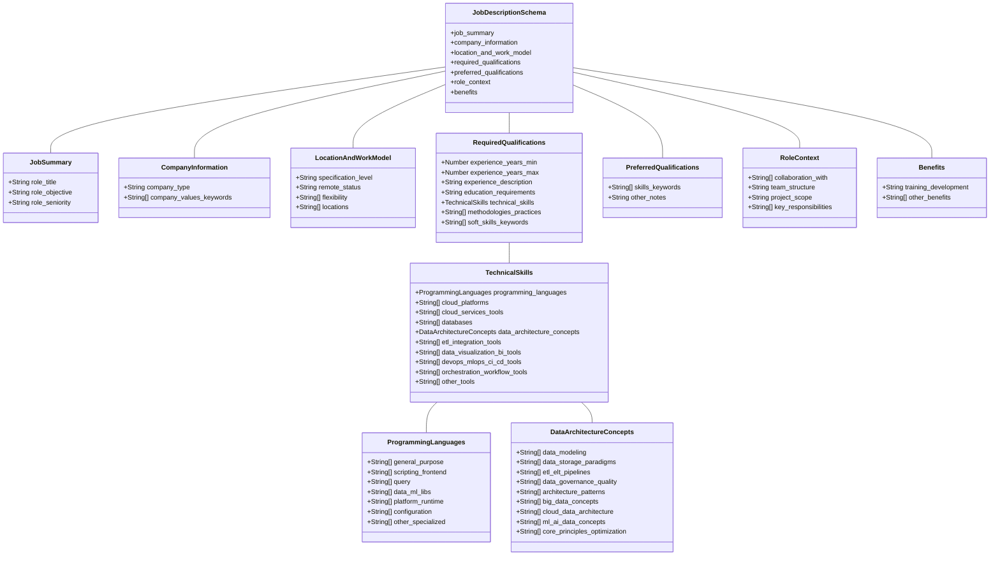

{
    "_comment": "Schema for storing structured job description data.",
  
    "job_summary": {
      "_comment": "High-level information about the role.",
      "role_title": "Data Engineer", // Standardized role title (e.g., from the 'role_title_implied' categories)
      "role_objective": "Reforçar a área de Data&AI da Deloitte...", // Extracted objective sentence/paragraph
      "role_seniority": "Mid-Level" // Controlled vocabulary
      // Possible Values for role_seniority: ["Internship", "Junior", "Mid-Level", "Senior", "Lead", "Staff", "Principal", "Manager", "Director", "Executive", "Not Specified"]
    },
  
    "company_information": {
      "_comment": "Details about the hiring company.",
      "company_type": "IT Consulting / System Integration", // Controlled vocabulary
      // Possible Values for company_type: ["Software Product / SaaS", "E-commerce / Marketplace Platform", "Fintech", "Gaming Company / GameTech", "IT Consulting / System Integration", "IT Outsourcing / Nearshore / Dev Shop", "Managed Service Provider (MSP)", "AI / Data Science Focused", "Open Source Software Company", "Low-Code / No-Code Platform", "Cloud / IT Infrastructure Services", "Digital Services / Agency", "Tech Hub / Academy / Recruitment", "Testing / Inspection / Certification", "Banking / Financial Institution", "Healthcare / Pharma / Biotech", "Automotive / Mobility Provider", "Manufacturing / Industrial", "Logistics / Transportation", "Energy", "Telecommunications", "Engineering Services (Non-IT specific)", "Internal IT / Shared Services", "Unspecified / Generic Tech", "Not Specified / Other"]
      "company_values_keywords": [ // Extracted list of keywords/phrases
        "Inovação",
        "Excelência",
        "Respeito",
        "Confiança",
        "Transparência"
        // ...etc
      ]
    },
  
    "location_and_work_model": {
      "_comment": "Where the role is based and the work model.",
      "specification_level": "Specific Location / Remote Status Identified", // Controlled vocabulary
      // Possible Values for specification_level: ["Specific Location / Remote Status Identified", "Not Specified"]
      "remote_status": "Hybrid", // Controlled vocabulary
      // Possible Values for remote_status: ["Fully Remote", "Remote (Region Specific)", "Hybrid", "Office-based", "Not Specified"]
      "flexibility": ["Flexible Schedule"], // List containing relevant keywords/flags
      // Possible Values for flexibility items: ["Flexible Schedule"]
      "locations": [ // Standardized list of locations (Cities, Countries, Regions)
        "Lisbon",
        "Porto",
        "Portugal"
      ]
    },
  
    "required_qualifications": {
      "_comment": "Mandatory requirements for the role.",
      "experience_years_min": 1,
      "experience_years_max": 6,
      "experience_description": "Experiência profissional entre 1 e 6 anos em projetos de Data",
      "education_requirements": "Licenciatura/ Mestrado nas áreas de Engenharia Informática, Engenharia Eletrotécnica e de Computadores, Matemática ou áreas similares", // Text description
      "technical_skills": {
        "_comment": "Specific technical tools, platforms, languages, and concepts.",
        "programming_languages": { // Standardized list of languages/frameworks/libraries
            "general_purpose": ["Python", "Scala"],
            "scripting_frontend": ["Bash / Shell Scripting"],
            "query": ["SQL", "DAX"],
            "data_ml_libs": ["Pandas", "PySpark", "Apache Spark"],
            "platform_runtime": [],
            "configuration": ["YAML"],
            "other_specialized": []
        },
        "cloud_platforms": ["AWS", "Azure", "GCP", "Alibaba Cloud"], // List of *major* platforms (Providers + Snowflake/Databricks if applicable)
        // Possible Values for cloud_platforms: ["AWS", "Azure", "GCP", "Alibaba Cloud", "Oracle Cloud", "IBM Cloud", "Snowflake", "Databricks", "Other", "Not Specified"]
        "cloud_services_tools": [ // List of specific standardized services/tools
          "AWS S3",
          "AWS Glue",
          "AWS Redshift",
          "AWS Lambda",
          "Azure Data Factory",
          "Azure Synapse Analytics",
          "Google BigQuery"
          // ...etc (drawn from the comprehensive standardized list)
        ],
        "databases": ["SQL Server", "PostgreSQL", "NoSQL Concepts"], // List of standardized databases/types
        // Possible Values for databases: ["PostgreSQL", "MySQL", "Microsoft SQL Server", "Oracle Database", "AWS RDS", "Azure SQL Database", "Google Cloud SQL", "MongoDB", "Cassandra", "Redis", "Elasticsearch", "DynamoDB", "Cosmos DB", "BigTable", "ClickHouse", "DuckDB", "SQL Concepts", "NoSQL Concepts", "Other"]
        "data_architecture_concepts": { // Selected standardized concepts
          "data_modeling": ["Dimensional Modeling (Kimball, Star/Snowflake Schemas)", "Schema Design & Evolution"],
          "data_storage_paradigms": ["Data Warehousing (DWH)", "Data Lake Architecture"],
          "etl_elt_pipelines": ["ETL Design & Development", "Batch Processing", "Stream Processing / Real-time Data"],
          "data_governance_quality": ["Data Quality Management & Measurement", "Data Cleansing Strategies"],
          "architecture_patterns": ["Medallion Architecture"],
          "big_data_concepts": ["Big Data Fundamentals (Volume, Velocity, Variety)"],
          "cloud_data_architecture": ["Scalable Cloud Data Solutions", "Cloud-native Data Services"],
          "ml_ai_data_concepts": [],
          "core_principles_optimization": ["Scalability Design"]
        },
        "etl_integration_tools": ["Informatica PowerCenter / IDMC", "Talend", "Azure Data Factory", "AWS Glue", "dbt (Data Build Tool)"], // Specific ETL/ELT/Integration tools
        "data_visualization_bi_tools": ["Tableau", "Microsoft Power BI", "Looker / Looker Studio"], // Specific Viz/BI tools
        "devops_mlops_ci_cd_tools": ["Git", "Jenkins", "Terraform", "Kubernetes", "Docker", "Azure DevOps", "MLflow"], // Specific tools for these areas
        "orchestration_workflow_tools": ["Apache Airflow", "Prefect"], // Specific orchestrators
        "other_tools": ["Jupyter Notebooks/Lab", "Alation (Data Catalog)"] // For tools not fitting above categories
      },
      "methodologies_practices": [ // Standardized list
        "Agile Principles",
        "Scrum",
        "DevOps Culture/Practices",
        "Test-Driven Development (TDD)"
      ],
      // Possible Values for methodologies_practices: ["Agile Principles", "Scrum", "Kanban", "Extreme Programming (XP)", "Lean Principles", "SAFe", "LeSS", "Waterfall", "DevOps Culture/Practices", "Test-Driven Development (TDD)", "Behavior-Driven Development (BDD)", "CI/CD Practices", "A/B Testing"]
      "soft_skills_keywords": [ // List of keywords/phrases
        "Trabalho em equipa",
        "Orientação para o cliente",
        "Comunicação",
        "Inglês"
        // ...etc
      ]
    },
  
    "preferred_qualifications": {
      "_comment": "Nice-to-have skills and qualifications.",
      "skills_keywords": ["Francês", "Alemão", "Certificações"], // List of languages, tools, concepts etc.
      "other_notes": "" // Optional text field
    },
  
    "role_context": {
       "_comment": "Information about the role's interactions and scope.",
       "collaboration_with": ["Stakeholders", "Colegas da rede Deloitte", "Equipas técnicas e funcionais"], // List or description
       "team_structure": "Integração nos centros de excelência e comunidade de Data da Deloitte...", // Text description
       "project_scope": "Variados e complexos projetos de transformação, nacionais e internacionais.", // Text description
       "key_responsibilities": [ // List extracted from description
          "Desenho e implementação de Arquiteturas de Dados escaláveis...",
          "Extrair, transformar e carregar (ETL) grandes volumes de dados...",
          "Definição e implementação de processos para controlo e tratamento de dados...",
          "Desenho e implementação de soluções real-time",
          "Colaborar com vários stakeholders...",
          "Assumir gradualmente a coordenação de equipas..."
       ]
    },
  
    "benefits": {
      "_comment": "Perks and benefits offered.",
      "training_development": "Plano de desenvolvimento de carreira personalizado, acesso ilimitado a plataformas de aprendizagem online (Linkedin Learning, Udemy), oportunidade de formações e certificações nas mais recentes tecnologias (incluindo Cloud).", // Text description or list
      "other_benefits": [] // List of other benefits mentioned (e.g., Health Insurance, Meal Allowance, etc.)
    }
  }